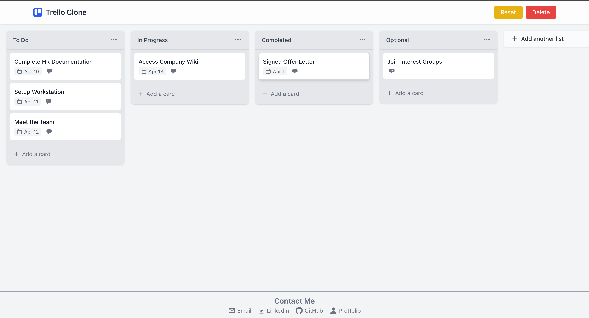

# StickIt - React & Tailwind CSS v4

A clean and functional web app built with **React**, **Vite**, and **Tailwind CSS v4** — featuring dynamic task management and intuitive drag-and-drop.

---

## 🚀 Features

- ### 🗃️ **List Management**
  - Create, rename, delete lists
  - Reorder lists via drag-and-drop

- ### 🗂️ **Card Management**
  - Add, edit (via modal), delete cards
  - Drag cards within and across lists

- ### 🫳 **Drag & Drop**
  - Smoothly between Cards and Lists

- ### 💾 **LocalStorage Persistence**
  - All changes saved automatically in the browser

- ### 🗑 **Board Reset and Delete ️**
  - One-click reset to clear all lists and cards

---

## Tech Stack

* **Framework:** React 18
* **Build Tool:** Vite
* **Styling:** Tailwind CSS v4 (using `@tailwindcss/vite`)
* **Drag & Drop:** `react-beautiful-dnd` v13
* **Icons:** `@heroicons/react`, `react-icons`

---
* **State Management:** React Hooks (`useState`, `useEffect`), Custom Hooks
* **Persistence:** Browser `localStorage` API

## 📸 Preview

    

